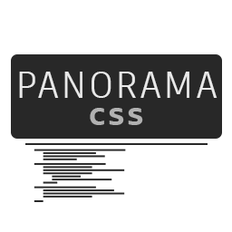

  

<h2 align="center">This VS Code extension provides support for Panorama's subset of CSS3.</h2>

  

  

  

  

[Panorama](https://developer.valvesoftware.com/wiki/Panorama) is UI framework developed and used by Valve used for many source games including CS:GO and Dota 2. For Panorama CSS documentation, see the [VDC page](https://developer.valvesoftware.com/wiki/CSGO_Panorama_CSS_Properties).

## Important Caveats

1. This extension removes coloring for non-Panorama properties for both CSS and SCSS. Make sure to **enable it per-workspace!**
2. No code completion for values introduced by Panorama apart from snippets, and in some cases misleading value completion where Panorama differs from W3C spec.

## Features

- SCSS support for Chaos Engine
- Coloring for CS:GO and Chaos Panorama panel names, properties, psuedo-selectors, etc.
- Code completion for Panorama properties and pseudo-selectors, but not values
- Snippets for gradient creation and other values
